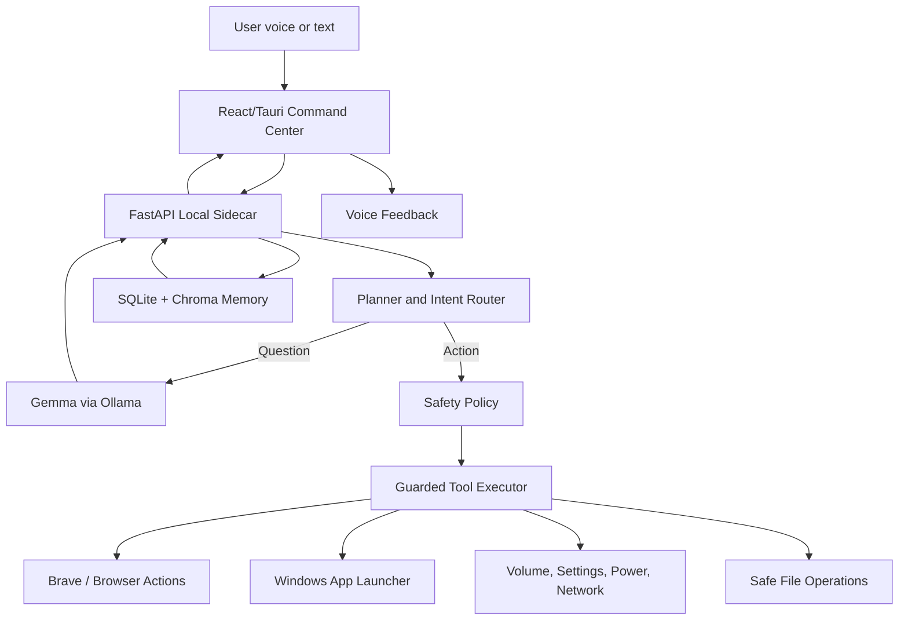
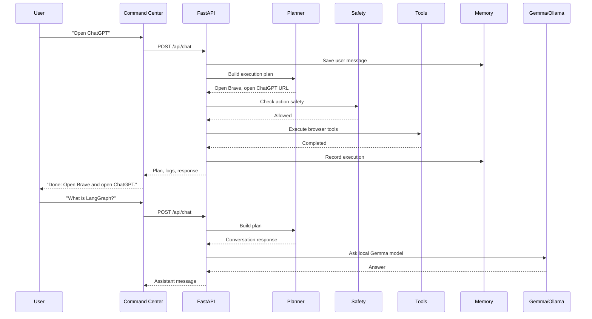
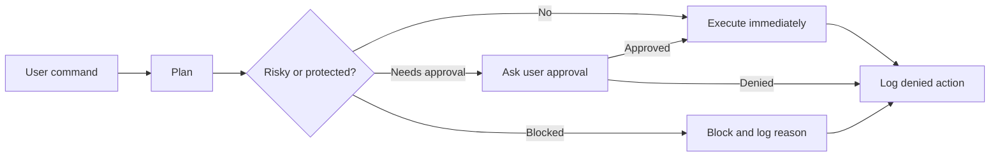

# NeuronOS

NeuronOS is a Windows-first local AI desktop assistant that uses Gemma through Ollama to understand natural language, plan safe computer actions, and execute local workflows from a voice or text command.

It runs as a local assistant shell for your PC, with a React/Tauri-ready interface and a FastAPI sidecar backend.

## Overview

NeuronOS supports both normal chat questions and task-oriented desktop commands:

```text
"Open ChatGPT"
"Play Faded on YouTube"
"Increase volume to 64"
"Remember that my LangGraph project is in D drive"
```

For action requests, it creates a local execution plan, checks safety rules, runs guarded tools, saves memory when needed, and reports the result in the UI.

## Local Model

Gemma is used through Ollama for local conversational responses. Deterministic routing handles safety-critical desktop actions so common PC commands stay predictable and fast, while the local model handles open-ended questions and fallback conversation.

NeuronOS uses Gemma for:

- answering normal questions, such as `What is LangGraph?`
- fallback conversation when a request is not a supported desktop action
- keeping open-ended assistant responses local instead of sending them to a cloud model
- local-first privacy, because model calls stay on the user's machine through Ollama

The default lightweight model is `gemma3:1b` for faster laptop response times. If your machine has enough free RAM, you can use Gemma 4 by setting `NEURONOS_CHAT_MODEL` or the fallback model:

```powershell
$env:NEURONOS_CHAT_MODEL="gemma4:e2b"
$env:OLLAMA_FALLBACK_MODEL="gemma4:e2b"
```

Pull the model first:

```powershell
ollama pull gemma4:e2b
```

Examples:

- `What is LangGraph?` -> answer conversationally with the local model.
- `Open Gmail` -> open Brave and go directly to Gmail.
- `Play Faded` -> open Brave and start a YouTube playback workflow.
- `Where is my LangGraph project?` -> retrieve saved local memory.

## Features

- Command-center UI built with React, Tailwind, and Tauri-ready desktop scaffolding.
- Local FastAPI sidecar backend.
- Gemma via Ollama for local conversation.
- Push-to-talk voice input with faster-whisper hooks.
- Browser actions through Brave by default.
- Windows app launching and local system controls.
- Memory with SQLite and optional Chroma semantic retrieval.
- Safety policy for terminal, file, system, and power actions.
- Execution log, live plan view, memory panel, and safe mode toggle.
- Human-like browser SpeechSynthesis voice feedback for completed tasks.

## Architecture



## Request Flow



## Core Backend Endpoints

| Endpoint | Purpose |
| --- | --- |
| `POST /api/chat` | Submit a text command and receive an assistant response, plan, memories, and execution results. |
| `POST /api/voice/transcribe` | Transcribe push-to-talk audio through faster-whisper. |
| `POST /api/tools/execute` | Execute approval-gated tool actions. |
| `GET /api/memory/search` | Search saved local memory. |
| `GET /api/events` | Stream execution and plan events. |

## Tool Families

| Tool family | Examples |
| --- | --- |
| Browser | Open ChatGPT, Gmail, Google Cloud, YouTube playback, web search. |
| Apps | Open Brave, VS Code, Discord, Settings, File Explorer, Notepad. |
| System | Set volume, open settings pages, brightness fallback, Wi-Fi/Bluetooth fallback, lock/restart/shutdown with safety gates. |
| Terminal | Safe command execution with approval and blocked destructive commands. |
| Memory | Save preferences, project locations, notes, and recall recent conversation context. |
| Files | Basic safe writes outside protected paths. |

## Safety Model

NeuronOS is designed for safe usefulness instead of unrestricted automation.

- Safe Mode asks before risky terminal or file actions.
- Dangerous terminal commands are blocked.
- Protected paths are blocked, including Windows system folders, program directories, and user secrets.
- Registry, boot, kernel, security, and destructive system changes are blocked.
- Shutdown requires approval.
- Execution history is logged locally.



## Local Data

By default on Windows, NeuronOS stores local state on the D drive:

```powershell
D:\NeuronOS\data
D:\NeuronOS\hf-cache
D:\Ollama\models
```

You can override these with environment variables:

```powershell
$env:NEURONOS_DATA_DIR="D:\NeuronOS\data"
$env:HF_HOME="D:\NeuronOS\hf-cache"
$env:OLLAMA_MODELS="D:\Ollama\models"
$env:NEURONOS_CHAT_MODEL="gemma3:1b"
$env:OLLAMA_FALLBACK_MODEL="gemma4:e2b"
```

## Prerequisites

- Windows 10/11
- Node.js and npm
- Python 3.11+
- `uv`
- Ollama
- A Gemma model pulled in Ollama, for example:

```powershell
ollama pull gemma3:1b
# Optional stronger fallback/model:
ollama pull gemma4:e2b
```

Optional:

- Rust/Cargo for the full Tauri desktop shell.
- faster-whisper model cache for voice transcription.

## Quick Start

Install frontend dependencies:

```powershell
npm install
```

Run the local assistant shell:

```powershell
.\scripts\neuronos.ps1
```

If Rust/Cargo is installed, the script starts Tauri. If Rust/Cargo is not installed, it starts the same assistant UI through Vite.

Run one command directly through the local assistant:

```powershell
.\scripts\neuronos.ps1 open chatgpt
```

## Manual Development

Run the backend:

```powershell
uv run --extra dev --extra voice uvicorn neuronos.main:app --app-dir backend --host 127.0.0.1 --port 8000
```

Run the frontend:

```powershell
npm run dev -- --host 127.0.0.1 --port 1420
```

Open:

```text
http://127.0.0.1:1420
```

## Example Commands

- `What is LangGraph?`
- `Open ChatGPT`
- `Open Gmail`
- `Play Faded on YouTube`
- `Increase volume to 64`
- `Remember that my LangGraph project is in D drive`
- `Where is my LangGraph project?`

## Testing

Run backend tests:

```powershell
uv run --extra dev --extra voice pytest
```

Run frontend tests:

```powershell
npm test
```

Build the frontend:

```powershell
npm run build
```

Current local verification:

```text
Backend: 128 tests passing
Frontend: 11 tests passing
Build: passing
```

## Project Structure

```text
backend/
  neuronos/
    main.py              FastAPI app and API routes
    planner.py           Intent routing and local execution plans
    tools.py             Guarded local tool executor
    safety.py            Safety policy
    memory.py            SQLite and Chroma-backed memory
    providers.py         Ollama/Gemma provider
    voice.py             faster-whisper transcription service
    windows_controls.py  Windows control helpers

frontend/
  src/
    App.tsx              Command center shell
    components/          Conversation, plan, memory, logs, voice UI
    styles.css           Desktop assistant visual system
    voiceStatus.ts       Browser speech feedback

scripts/
  neuronos.ps1           Windows launcher for backend + desktop/dev UI

src-tauri/
  Tauri desktop scaffold
```

## Roadmap

- Stronger Gemma tool-calling and structured planning.
- Better website action verification.
- Deeper app-specific automations.
- More accurate local voice pipeline.
- Richer memory retrieval and workflow restore.
- Optional offline-only mode.
- Full Tauri packaging for a one-click Windows desktop app.

## Contact

- GitHub: [ANSHUL-REAL](https://github.com/ANSHUL-REAL)
- LinkedIn: [Anshul Nautiyal](https://www.linkedin.com/in/anshul-nautiyal-42760236b/)
- Email: [anshulnautiyal0512@gmail.com](mailto:anshulnautiyal0512@gmail.com)
